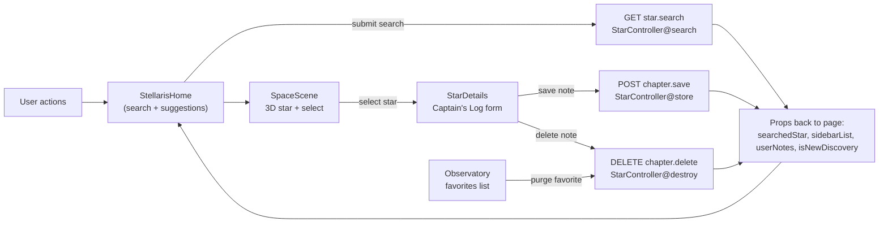

# Frontend (Inertia + React) Overview

This guide focuses on the Inertia/React side of Stellaris, showing key functions with small code excerpts and how they talk to backend routes or other components.

## Frontend data flow (visual)



## Entry & Page Resolution
**File:** `resources/js/app.jsx`
```jsx
createInertiaApp({
  resolve: (name) =>
    resolvePageComponent(`./Pages/${name}.jsx`, import.meta.glob('./Pages/**/*.jsx')),
  setup({ el, App, props }) { createRoot(el).render(<App {...props} />); },
});
```
*Inertia bootstraps React pages. Each page receives server props from controllers (e.g., `StarController`).*

## Main Console (StellarisHome)
**File:** `resources/js/Pages/StellarisHome.jsx`
```jsx
const { data, setData, get, processing } = useForm({ query: '' });

const handleSearch = (e) => {
  e.preventDefault();
  get(route('star.search'), { preserveState: true, preserveScroll: true });
};

const clickSuggestion = (name) => {
  setData('query', name);
  setTimeout(() => router.get(route('star.search'), { query: name }, { preserveState: true }), 100);
};
```
*Search requests go to the backend route `star.search` (`StarController@search`). Props returned (e.g., `searchedStar`, `sidebarList`, `isNewDiscovery`) repopulate this page.*

```jsx
useEffect(() => { if (searchedStar) setSelectedStar(searchedStar); }, [searchedStar]);
```
*When the controller returns a star, it updates local state and feeds child components.*

### Modals & Profile
`showCaptain` and `showProfile` control UI-only modals; they do not hit the backend. Session storage keys are scoped per user id.

## 3D Scene & Selection
**File:** `resources/js/Components/SpaceScene.jsx`
```jsx
{searchedStar && (
  <Float>
    <FoundStar data={searchedStar} onSelect={onStarSelect} />
  </Float>
)}
```
*Receives `searchedStar` from `StellarisHome` (originating from server). Clicking the star triggers `onStarSelect`, which opens details.*

## Star Details & Captain’s Log
**File:** `resources/js/Components/StarDetails.jsx`
```jsx
const { data, setData, post, delete: destroy } = useForm({
  star_name: star ? star.name : '',
  story_chapter: userNote ? userNote.story_chapter : ''
});

const handleSubmit = (e) => {
  e.preventDefault();
  post(route('chapter.save'), { preserveScroll: true, preserveState: true });
};

const handleDelete = () => {
  destroy(route('chapter.delete', star.name), { preserveScroll: true, preserveState: true, onSuccess: onClose });
};
```
*Forms talk to backend routes `chapter.save` (POST) and `chapter.delete` (DELETE), mapped to `StarController@store` and `StarController@destroy`. Updated notes are sent back as props on the next render.*

## Observatory (Favorites)
**File:** `resources/js/Pages/Observatory.jsx`
```jsx
const { delete: destroy } = useForm();
const handleDelete = (starName) => destroy(route('chapter.delete', starName));
```
*Purging a favorite reuses the same delete route and controller as above.*

## Layout & Effects
**File:** `resources/js/Layouts/CosmicLayout.jsx`
```jsx
<AnimatePresence mode="wait">
  <motion.div initial={{ opacity: 0 }} animate={{ opacity: 1 }}>
    {children}
  </motion.div>
</AnimatePresence>
```
*Provides the HUD look, custom cursor, and page transitions. No backend interaction.*

## Quick Interaction Map
- `StellarisHome` search → **GET** `star.search` → `StarController@search` → returns `searchedStar`, `sidebarList`, `userNotes`.
- `StarDetails` save → **POST** `chapter.save` (`StarController@store`) → updates notes → props refresh.
- `StarDetails` delete / `Observatory` purge → **DELETE** `chapter.delete` (`StarController@destroy`) → removes note → props refresh.
- `Observatory` page props come from `StarController@observatory` (`favorites` list).

Use this as a front-end-first map to see where each UI action connects to the backend and how props flow back into React components.
